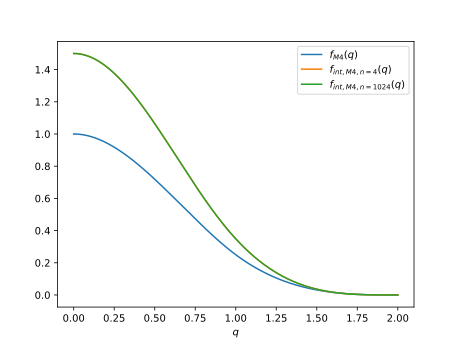
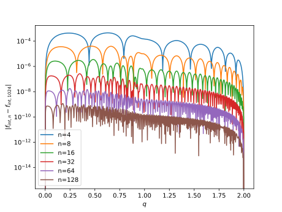

# Plotting results

In SPH we have access to slice rendering, it can be used in runscripts as follows :
```py
import matplotlib
# Reset the figure using the same memory as the last one
plt.figure(num=1, clear=True,dpi=200)
import copy
my_cmap = copy.copy(matplotlib.colormaps.get_cmap('gist_heat')) # copy the default cmap
my_cmap.set_bad(color="black")

sinks = model.get_sinks()

ext = 5
arr = model.render_cartesian_slice("rho","f64",center = (0.,0.,0.),delta_x = (ext*2,0,0.),delta_y = (0.,ext*2,0.), nx = 1000, ny = 1000)
res = plt.imshow(arr, cmap=my_cmap,origin='lower', extent=[-ext, ext, -ext, ext], norm="log", vmin=1e-8, vmax=2e-4)

ax = plt.gca()

output_list = []
for s in sinks:
    x,y,z = s["pos"]
    output_list.append(
        plt.Circle((x, y), s["accretion_radius"], color="blue", fill=False))
for circle in output_list:
    ax.add_artist(circle)

plt.xlabel("x")
plt.ylabel("y")
plt.title("t = {:0.3f} [Binary orbit]".format(model.get_time() / (2*np.pi)))

cbar = plt.colorbar(res, extend='both')
cbar.set_label(r"$\rho$ [code unit]")
plt.show()
```

In this sample the core function to be used is `model.render_cartesian_slice` which will
render the slice using the GPU trees. It will return a numpy array with the slice.


The arguments to be passed to the function are :

- `field name`: the field name to render
- `field_type`: the type of the data to be rendered
- `center`: the center of the slice
- `delta_x` and `delta_y`: the size of the slice
- `nx` and `ny`: the number of pixels in the slice


## Column density algorithm

The standard SPH kernel is defined as being

\[
    W(\mathbf{r},h) = \frac{C_{norm}}{h^3} f\left(q = \vert \frac{\mathbf{r}}{h}\vert \right)
\]

If we integrate along the z axis we can define a new kernel

\[
    Y(x,y,h) = \frac{C_{norm}}{h^3} \int \mathrm{d}z \, f\left(q = \vert \frac{\mathbf{r}}{h}\vert \right)
\]

Which can can transform as follows

\[
    Y(x,y,h) = \frac{C_{norm}}{h^2} \int \mathrm{d}q_z \, f\left(\sqrt{q_x^2 + q_y^2 + q_z^2}\right) = \frac{C_{norm}}{h^2}  g\left(\sqrt{q_x^2 + q_y^2 }\right)
\]

where

\[
    g(q_x) = \int \mathrm{d}q_z \, f\left(\sqrt{q_x^2  + q_z^2}\right)
\]

We can use a Riemann sum to integrate this function, this gives the following plot



We can see here that already with only 4 points in the riemann sum we approximate the kernel $g$ fairly well.
We can compare the error with a large number of points (1024 here)



indeed only 4 points yield a sufficient precision for the integrated kernel, which make it
sufficiently cheap to be usable as is.
