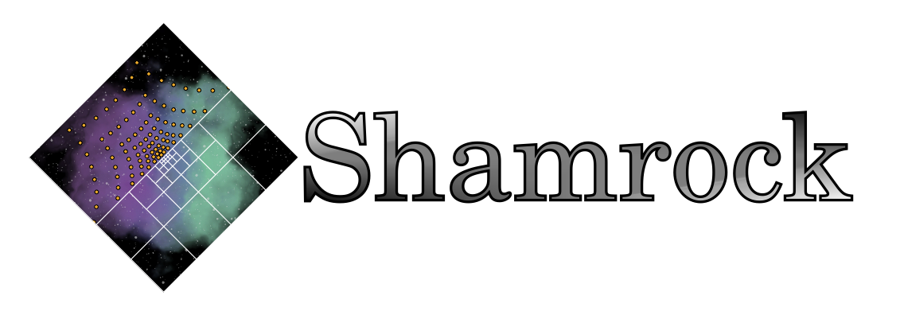

<picture>
   <source media="(prefers-color-scheme: dark)" srcset="doc/shamrock-doc/src/images/no_background_nocolor.png"  width="600">
   
 </picture>

# Shamrock units library

This is the units library in use in the Shamrock code, this repository will be updated when change are made to this library in the Shamrock monorepo. 

```c++

int main(void){

    using namespace shamunits;

    //create si units
    UnitSystem<double> si {};

    // get the value of au^2 in the unit system
    // but it is quite big :)
    std::cout << si.get<units::astronomical_unit,2>() << std::endl;

    double sol_mass = Constants<double>(si).sol_mass();

    /*
    * create a unit system with time in Myr, lenght in au, mass in solar masses
    */
    UnitSystem<double> astro_units {
        si.get<mega, units::years>(),
        si.get<units::astronomical_unit>(),
        si.get<units::kilogramm>()*sol_mass,
    };

    //this time it returns 1 because the base lenght is the astronomical unit
    std::cout << astro_units.get<units::astronomical_unit,2>() << std::endl;

    Constants<double> astro_cte {astro_units};

    // in those units G is 3.94781e+25
    std::cout << astro_cte.G() << std::endl;

}

```